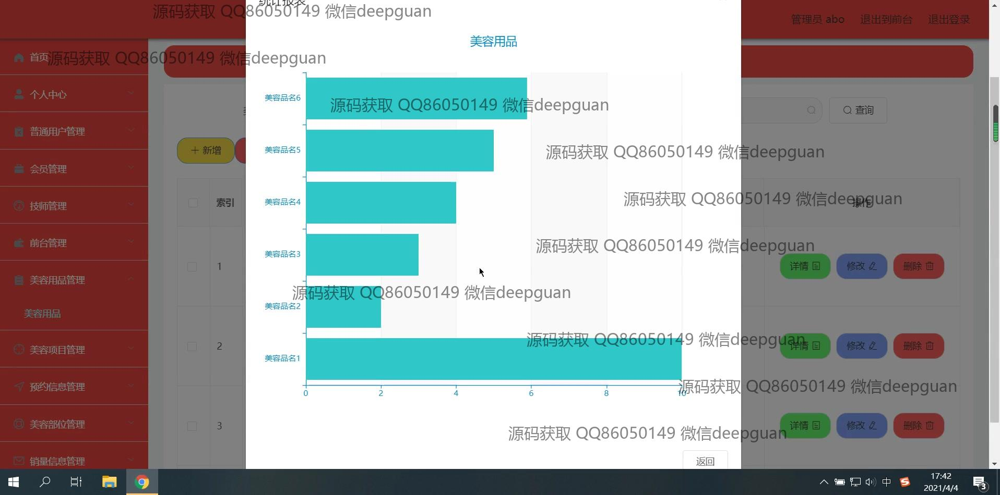
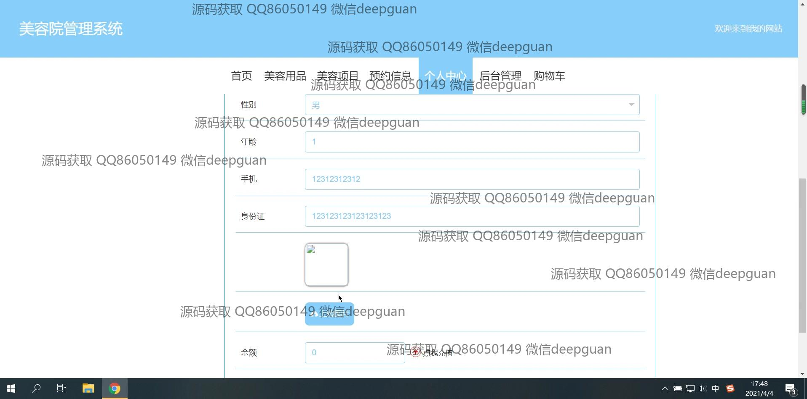
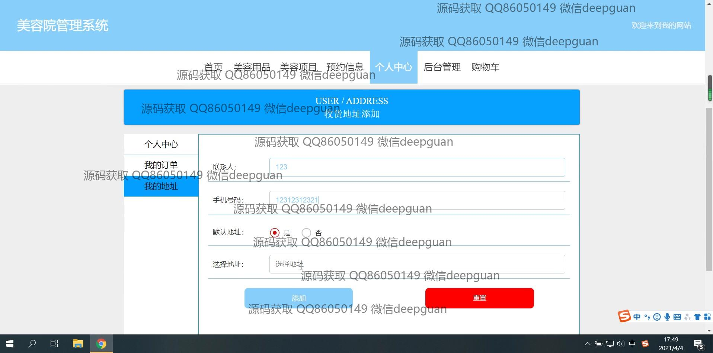

<h1 align="center">美容院管理系统</h1>

## 简介
美容院管理系统：角色分为管理员、技师和前台；主要功能包括用户管理、会员管理、技师管理、美容项目管理、预约信息管理和销售信息管理。系统旨在提高美容院运营效率，实现高效的客户服务与管理。    --计算机毕业设计源码；毕设源码；java毕业设计源码

## 联系方式

<h3 align="center">获取完整代码与数据库文件 + 微信：deepguan QQ: 86050149 QQ群: 783742310</h3>

<h3 align="center">可帮忙远程部署 包运行成功！提供远程部署、修改代码、设计文档指导、代码讲解等服务！</h3>

## 功能介绍（完整见运行截图）
管理员： 管理员负责美容院管理系统的整体管理，包括用户账号的创建、修改和删除，美容用品和项目的添加、编辑和库存管理，以及查看和处理预约信息。可以通过系统导航快捷访问各个模块，如用户管理、会员管理、技师管理、和预约信息管理。管理员还可以查看系统中的销售信息，生成财务报表，帮助优化美容院的运营和管理效率。系统具备录入用户和技师信息、监控商品库存、审核预约及处理订单的功能。管理员可以设置并维护个人信息，管理个人中心内容，以及进行账户余额的充充值操作。

普通用户： 普通用户在系统中能够查看和管理个人信息，并进行美容项目和用品的浏览和购买。可通过个人中心模块查看和更改个人信息，如更新联系信息、查看预约记录和编辑地址簿等。用户可以在系统中选择美容项目，查看服务详情，并预约合适的技师。购物车功能允许用户选择美容用品进行结算，支持多种在线支付方式，如微信支付和支付宝。用户通过客服功能，可以与美容院畅通沟通，获取及时反馈。普通用户还可以通过注册页面创建新账户，选择普通用户身份进行系统访问，享用美容院的各种会员服务。

技师： 技师通过专用入口登录美容院管理系统后，可以查看个人工作安排，管理自己的预约时段和工作进度。技师能够查看和更新个人信息，以及客户对服务的反馈。系统提供技师排班管理功能，帮助合理安排工作时间，提升服务效率。技师能通过系统接收管理方的任务分配，还可参与到技师信息的更新和维修工具、用品的管理中。此外，技师可以为自己积累的工作业绩进行统计和回顾，以便提升自身的服务质量。

前台： 前台用户通过系统界面进行客户信息的录入与管理，主要负责接待和安排客户预约。前台员工可以使用系统提供的导航菜单快速访问预约信息、会员管理、以及美容项目模块。在与客户沟通时，前台可利用系统快速调取客户档案，提供个性化服务。系统还支持前台员工对客户购物车、结算过程以及订单信息的查看和操作。前台角色亦可为美容院的销售活动和促销策略提供支援，通过查看销售数据和顾客反馈，协助提高美容院整体服务水平。

## 运行截图

本代码来源于网络,仅供学习参考使用!

